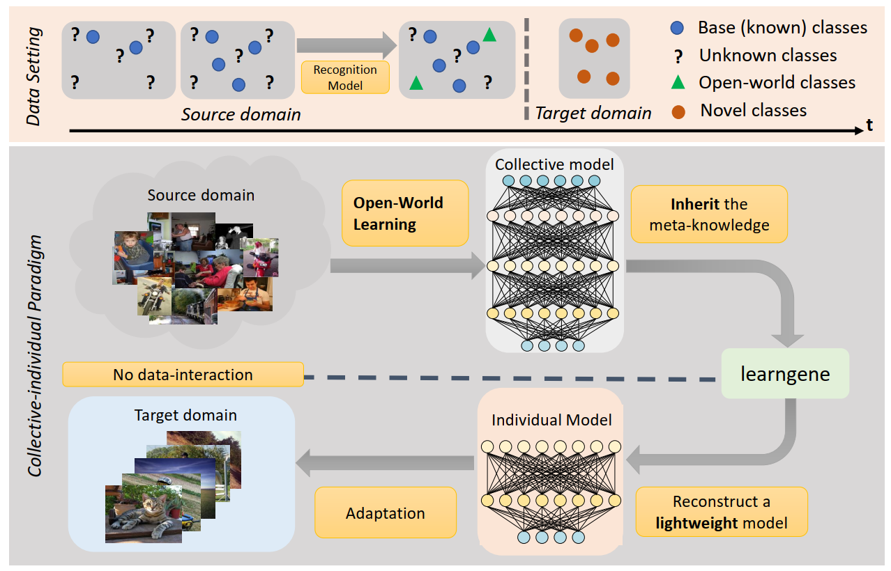

# Learngene: From Open-World to Your Learning Task

[bilibili](https://www.bilibili.com/video/BV1cF411b7oX?share_source=copy_web) [ArXiv](https://arxiv.org/pdf/2106.06788.pdf)

If you use the code in this repo for your work, please cite the following bib entries:
```bibtex
@inproceedings{wang2021learngene,
    title={Learngene: From Open-World to Your Learning Task}, 
    author={Wang, Qiufeng and Geng, Xin and Lin, Shuxia and Xia, Shiyu and Qi, Lei and Xu, Ning},
    year={2022},
    booktitle = {Proceedings of the 36th AAAI Conference on Artificial Intelligence (AAAI 2022)},
}
```
 
 ## Abstract
Although deep learning has made significant progress on fixed large-scale datasets, it typically encounters challenges regarding improperly detecting unknown/unseen classes in the open-world scenario, over-parametrized, and overfitting small samples. Since biological systems can overcome the above difficulties very well, individuals inherit an innate gene from collective creatures that have evolved over hundreds of millions of years and then learn new skills through few examples. Inspired by this, we propose a practical collective-individual paradigm where an evolution (expandable) network is trained on sequential tasks and then recognize unknown classes in real-world. Moreover, the learngene, i.e., the gene for learning initialization rules of the target model, is proposed to inherit the meta-knowledge from the collective model and reconstruct a lightweight individual model on the target task. Particularly, a novel criterion is proposed to discover learngene in the collective model, according to the gradient information. Finally, the individual model is trained only with few samples on the target learning tasks. We demonstrate the effectiveness of our approach in an extensive empirical study and theoretical analysis.



## Make dataset
Data division refers to [appendix](https://github.com/BruceQFWang/learngene/blob/main/Learngene_Appendix.pdf).
You can download the processed Cifar100_division [here](https://drive.google.com/file/d/1MKWi7dsjp3RQkKrcLV7ljZxJ4sm3YTL5/view?usp=sharing).

Make continual data (source domain) and target data(target domain) on the CIFAR100 dataset:

```bash
DATAPATH=YOUR_PATH_TO_THE_DATASET
cd utils
python data_cifar_mk.py --num_imgs_per_cat_train 600 --path $DATAPATH
```
    
Make continual data (source domain) and target data(target domain) on the ImageNet100 dataset:
```bash
DATAPATH=YOUR_PATH_TO_THE_DATASET
cd utils
python data_imagenet_mk.py --path $DATAPATH
```
## Generate collective model
Train collective model on the CIFAR100 dataset:
    
```bash
cd collective-model
python val_lifelong_cifar100.py --batch_size 64 --epochs 100 --num_works 50 --path [name of continualdataset path]
```
Train collective-model on the ImageNet100 dataset:

```bash
cd collective-model
python val_lifelong_imagenet.py --batch_size 64 --epochs 100 --num_works 50 --path [name of continualdataset path]
```

Validate judgement criterion on the CIFAR100 dataset:

```bash
cd collective-model
python val_lifelong_cifar100.py --batch_size 64 --epochs 100 --num_works 50 --judgement --path [name of continualdataset path]
```

Validate judgement criterion on the ImageNet100 dataset:
    
```bash
cd collective-model
python val_lifelong_imagenet.py --batch_size 64 --epochs 100 --num_works 50 --judgement --path [name of continualdataset path]
```
 
 ## Reconstruct individual model
 Reconstruct individual model on the CIFAR100 dataset:

```bash
python inheritable_cifar100_wEWC.py --batch_size 32 --epochs 30 --num_works 21 --num_works_tt 5  --num_imgs_per_cat_train [10 or 20] --path [name of inheritabledataset path]
```

 Reconstruct individual model on the ImageNet100 dataset:
 
```bash
python inheritable_random_trainnum200_wEWC.py --batch_size 32 --epochs 30 --num_works 21 --num_works_tt 10 --num_imgs_per_cat_train [10 or 20] --path [name of inheritabledataset path]
```
 
## Acknowledgment
Our project references the codes in the following repos.
- [CloserLookFewShot](https://github.com/wyharveychen/CloserLookFewShot)

- [DeepEMD](https://github.com/icoz69/DeepEMD)
